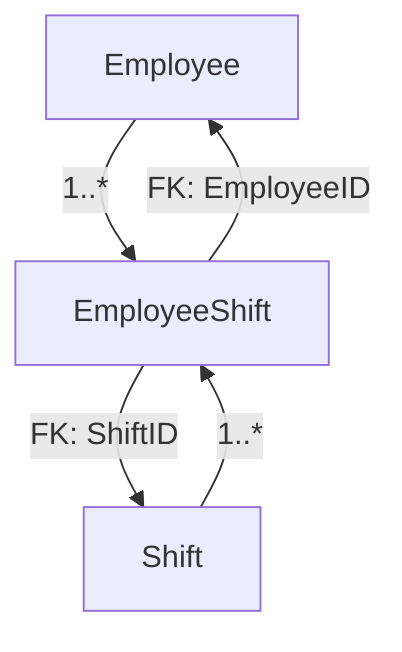

# Staff Management CMS

A passion project by **Omole Emmanuel Oreoluwa** to learn and demonstrate the fundamentals of web development with ASP.NET Core. This application is a simple Content Management System (CMS) for managing employees and their work shifts.

## About The Project

This project was built as a learning exercise to understand the core concepts of building a modern, data-driven web application from the ground up. It covers the full development lifecycle, from database design and implementation to creating a custom, styled front-end.

## Features

* **Employee Management:** Full CRUD (Create, Read, Update, Delete) functionality for employees.
* **Shift Management:** Full CRUD functionality for shifts.
* **Shift Assignment:** Assign employees to shifts and view assignments.
* **Custom UI:** A modern, responsive user interface with a sidebar navigation and card-based layouts.
* **RESTful API:** Basic API endpoints for employees and shifts.

## Technologies Used

This project is built on the .NET platform and utilizes several key technologies:

* **Backend:**
  * **ASP.NET Core MVC:** For building the web application following the Model-View-Controller pattern.
  * **Entity Framework Core:** As the Object-Relational Mapper (ORM) to interact with the database.
  * **RESTful APIs:** API controllers to expose application data.
* **Database:**
  * **SQLite:** A lightweight, file-based database, managed via Entity Framework Core migrations.
* **Frontend:**
  * **Razor Views:** For creating dynamic web pages.
  * **Bootstrap:** For the core layout and component styling.
  * **Custom CSS:** For creating a unique visual identity for the application.
* **Architecture & Patterns:**
  * **MVC (Model-View-Controller):** To separate concerns within the application.
  * **Service Pattern (using Interfaces):** To abstract the business logic from the controllers.
  * **Dependency Injection:** Using the built-in .NET container to manage service lifetimes.

## Data Models & Relationships

The core of the application revolves around three main data models that define the structure of the database.



### 1. EmployeeModel

Stores information about an individual employee.

- `EmployeeID` (Primary Key): Unique identifier for the employee.
- `FirstName`: Employee's first name.
- `LastName`: Employee's last name.
- `Email`: Employee's email address.
- `Role`: The job role of the employee (e.g., "Manager", "Cashier").
- `HourlyRate`: The pay rate for the employee.
- `DateHired`: The date the employee was hired.

### 2. ShiftModel

Stores information about a single work shift.

- `ShiftID` (Primary Key): Unique identifier for the shift.
- `StartDateTime`: The date and time the shift begins.
- `EndDateTime`: The date and time the shift ends.

### 3. EmployeeShiftModel (Join Table)

This model connects Employees and Shifts, creating a **many-to-many relationship**. One employee can be assigned to many shifts, and one shift can have many employees assigned to it.

- `EmployeeShiftID` (Primary Key): Unique identifier for the assignment entry.
- `EmployeeID` (Foreign Key): Links to the `EmployeeID` in the `EmployeeModel`.
- `ShiftID` (Foreign Key): Links to the `ShiftID` in the `ShiftModel`.

## Getting Started

To get a local copy up and running, follow these simple steps.

### Prerequisites

* .NET SDK (This project uses .NET 8)

### Installation & Setup

1. **Clone the repository:**
   ```sh
   git clone https://github.com/Omoleen/StaffManager
   ```
2. **Navigate to the project directory:**
   ```sh
   cd StaffManager
   ```
3. **Restore dependencies:**
   This command will download all the necessary NuGet packages.
   ```sh
   dotnet restore
   ```
4. **Apply database migrations:**
   This will create the `app.db` SQLite database file and set up the schema.
   ```sh
   dotnet ef database update
   ```
5. **Run the application:**
   ```sh
   dotnet run
   ```
   The application will be available at `https://localhost:5001` or a similar address, which will be specified in the terminal output.
